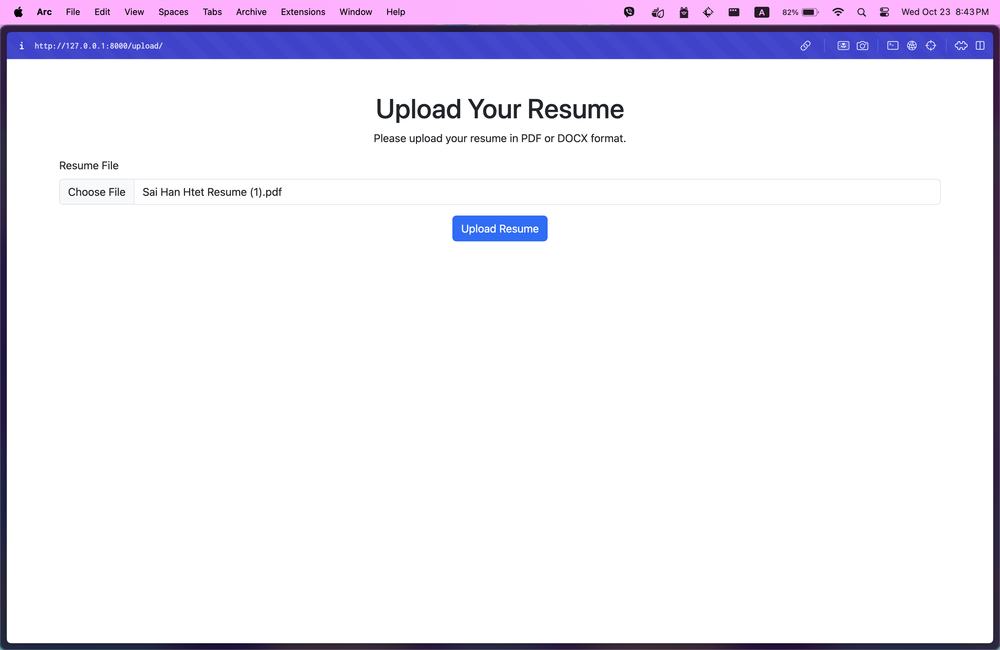

# Personal Development Plan Generator

A Django web application that allows users to upload their resumes in PDF or DOCX format and generates a personalized development plan based on the information provided in the resume.

## Table of Contents

- [Features](#features)
- [Technologies Used](#technologies-used)
- [Installation](#installation)
- [Usage](#usage)
- [Project Structure](#project-structure)
- [License](#license)

## Features

- Upload resumes in PDF or DOCX format.
- Generate a personalized development plan in HTML format.
- View the development plan in a user-friendly interface.

## Technologies Used

- **Python 3.10.15**
- **Django 5.1.2**
- **Bootstrap 5.3**
- **OpenAI API** (for generating development plans)
- **Markdown** (for rendering content)

## Installation

Follow these steps to set up the project locally:

1. **Clone the repository:**

   ```bash
   git clone https://github.com/saihanhtet/personal_dev_plan.git
   cd personal_dev_plan
   ```

2. **Create a virtual environment:**

   If you are using `venv`, run:

   ```bash
   python -m venv venv
   source venv/bin/activate  # On Windows use `venv\Scripts\activate`
   ```

   If you are using Conda, run:

   ```bash
   conda create --name djenv python=3.10.15
   conda activate djenv
   ```

3. **Install dependencies:**

   Install the required packages using `pip`:

   ```bash
   pip install -r requirements.txt
   ```

4. **Set up the environment variables:**

   Create a `.env` file in the project root and add the following line to specify your OpenAI API key:

   ```plaintext
   OPENAI_API_KEY=your_openai_api_key
   ```

5. **Run database migrations:**

   Initialize the database:

   ```bash
   python manage.py migrate
   ```

6. **Start the development server:**

   Run the following command to start the server:

   ```bash
   python manage.py runserver
   ```

   The application will be available at `http://127.0.0.1:8000`.

## Usage

1. Navigate to the web application in your browser.
2. Click on the "Upload Your Resume" link.
3. Select a PDF or DOCX file from your device and click "Upload Resume".
4. After processing, you will be redirected to a success page displaying your personalized development plan.

## Project Structure

Here's a brief overview of the project structure:

```
personal_dev_plan/
│
├── core/                  # Core Django application
│   ├── migrations/        # Database migrations
│   ├── __init__.py
│   ├── asgi.py
│   ├── settings.py
│   ├── urls.py
│   └── wsgi.py
│
├── dev_plan/             # App for handling development plans
│   ├── migrations/
│   ├── __init__.py
│   ├── admin.py
│   ├── apps.py
│   ├── forms.py
│   ├── models.py
│   ├── tests.py
│   ├── views.py
│   ├── templates/            # HTML templates
│   │   ├── upload.html
|   │   └── success.html
│
├── media/resumes          # Store the resume files
├── static                 # Store the statics files
├── .env                   # Environment variables
├── .gitignore             # Git ignore file
├── manage.py              # Django management script
└── requirements.txt       # Python package dependencies
├── readme.md
```

## Screenshot





## License

This project is licensed under the MIT License. See the [LICENSE](LICENSE) file for more details.

## Acknowledgements

- Special thanks to the OpenAI team for providing the API that powers the development plan generation.
- Inspiration for this project came from various online resources and tutorials on Django development.
